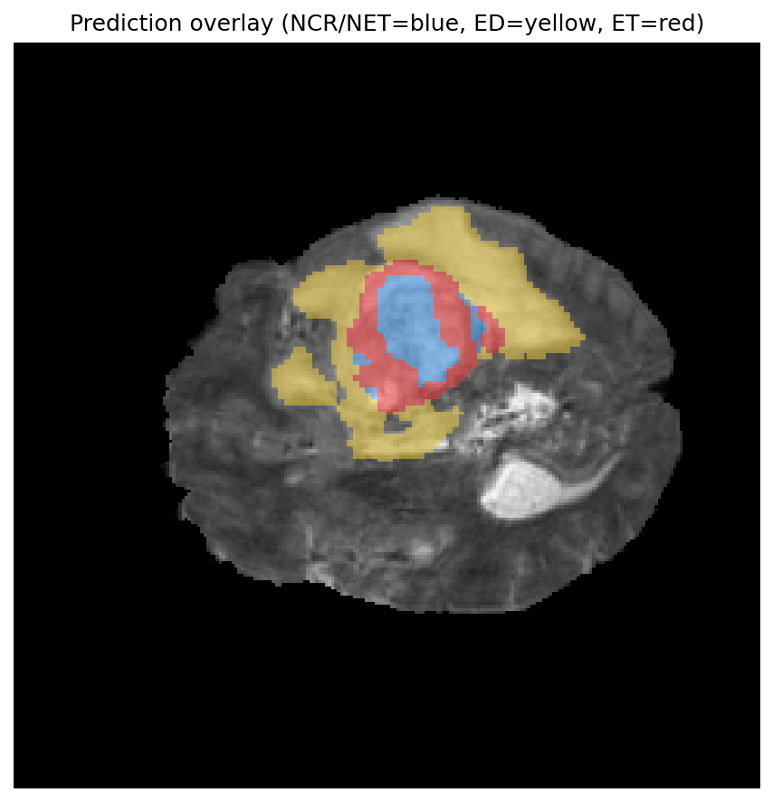
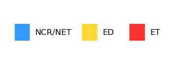

# BraTS reporting (2D UNet + mask features + LLM narrative)

Train a **2D U-Net** on BraTS-style HDF5 slices, then run **slice-wise inference** on a full volume, extract **deterministic mask statistics** (size, subregion fractions, enhancing-tumor lesion count), and optionally turn them into a **structured radiology-style report** via the [DeepSeek](https://www.deepseek.com/) API (OpenAI-compatible).

This workflow is inspired by the idea that **numbers come from the segmentation**, while the **LLM only formats language**—similar in spirit to [BTReport: A Framework for Brain Tumor Radiology Report Generation with Clinically Relevant Features](https://arxiv.org/pdf/2602.16006) (see [`info/report.md`](info/report.md) for notes and an example report shape).

> **Disclaimer:** For research and education only. Output is **not** a clinical diagnosis. Advanced findings (midline shift, lobar location, ventricle invasion, etc.) are **not** computed here unless you extend the pipeline; the prompt instructs the model **not to invent** those fields.

---

## Features

- **Training:** multiclass or multilabel 2D U-Net on `volume_*_slice_*.h5` files; saves `checkpoints/best.pt`.
- **Reporting:** loads one patient volume, runs the checkpoint with the same preprocessing as training, aggregates a 3D label volume, writes **JSON features**, **PNG visualizations**, and **`volume_<id>_report.md`** (DeepSeek).
- **No API:** use `--no-llm` to generate features and figures only.

---

## Requirements

- Python 3.10+ recommended  
- PyTorch with CUDA (optional, for faster training/inference)  
- A folder of BraTS-style H5 slices (see [Data format](#data-format))

### Install

```bash
git clone https://github.com/YOUR_USERNAME/brats-reporting.git
cd brats-reporting
python -m venv .venv
```

**Windows (PowerShell):** `.venv\Scripts\Activate.ps1`  
**macOS/Linux:** `source .venv/bin/activate`

```bash
pip install -r requirements.txt
```

---

## Data format

Each file is named:

`volume_<patient_id>_slice_<slice_index>.h5`

Inside each file:

| Dataset | Shape | Description |
|--------|--------|-------------|
| `image` | `(H, W, 4)` | Multimodal MRI (e.g. T1, T1ce, T2, FLAIR), float32 |
| `mask` | `(H, W, 3)` | Tumor subregions (used during **training**; inference uses the model only) |

Class order for reporting matches the three mask channels → labels **1 = NCR/NET**, **2 = ED**, **3 = ET** (see [`dataset/dataset_loader.py`](dataset/dataset_loader.py)).

More context: [`dataset/dataset.md`](dataset/dataset.md).

---

## Configuration

### Environment variables

| Variable | Used by | Purpose |
|----------|---------|---------|
| `BRATS_DATA_ROOT` | `train.py`, `report.py` | Directory containing `volume_*_slice_*.h5` |
| `DEEPSEEK_API_KEY` | `report.py` | API key for DeepSeek (or set in `.env`) |

### Optional `.env` (not committed)

Create a `.env` file in the project root (it is listed in [`.gitignore`](.gitignore)):

```env
BRATS_DATA_ROOT=D:\path\to\your\h5\folder
DEEPSEEK_API_KEY=your_key_here
```

---

## Train the model

```bash
python train.py
```

Same as:

```bash
python train.py --data-root %BRATS_DATA_ROOT%
```

Useful options:

| Option | Default | Notes |
|--------|---------|--------|
| `--epochs` | `50` | |
| `--batch-size` | `4` | |
| `--lr` | `1e-4` | |
| `--target-h`, `--target-w` | `128`, `128` | Use `0` for both for full-resolution slices (e.g. 240×240) |
| `--mask-mode` | `multiclass` | `multiclass` or `multilabel` |
| `--checkpoint-dir` | `checkpoints` | Best weights → `checkpoints/best.pt` |
| `--amp` | off | Mixed precision on CUDA |

The checkpoint stores `mask_mode`, `n_classes`, and `target_hw` so **inference matches training**.

---

## Generate a report (one volume)

With `BRATS_DATA_ROOT` set and `checkpoints/best.pt` present:

```bash
python report.py
```

Defaults:

- Volume **`volume_1_slice_*.h5`**
- Checkpoint **`checkpoints/best.pt`**
- Output directory **`examples/`**
- Device: **CUDA** if available, else **CPU**

### Useful CLI options

| Option | Default | Description |
|--------|---------|-------------|
| `--data-root` | `BRATS_DATA_ROOT` | Override H5 folder |
| `--volume-id` | `1` | Patient id in filenames |
| `--checkpoint` | `checkpoints/best.pt` | Model weights |
| `--out-dir` | `examples` | Where JSON, PNG, and Markdown are written |
| `--device` | auto | `cuda` or `cpu` |
| `--no-llm` | off | Skip DeepSeek; still writes features + images |
| `--bg-channel` | `3` | MRI channel (0–3) for overlay background |
| `--spacing-mm D H W` | `1 1 1` | Voxel spacing in mm for bbox size in cm |
| `--min-component-voxels` | `50` | Minimum ET size to count as a separate lesion |
| `--multilabel-threshold` | `0.5` | Sigmoid threshold if trained with `multilabel` |
| `--deepseek-model` | `deepseek-chat` | DeepSeek chat model name |

The system prompt lives in [`promts/report_prompt.txt`](promts/report_prompt.txt) (folder name is spelled `promts` in this repo).

---

## Outputs (under `examples/`)

After a successful run you typically get:

| File | Description |
|------|-------------|
| `volume_<id>_features.json` | Mask-derived numbers + `not_computed` nulls for atlas/clinical fields |
| `volume_<id>_slice<N>_overlay.png` | One axial slice with **largest tumor area**: MRI + semi-transparent prediction |
| `segmentation_legend.png` | NCR/NET, ED, ET color key |
| `volume_<id>_report.md` | Markdown report from DeepSeek (or a short stub if `--no-llm`) |

### Example: feature JSON (excerpt)

The `computed` block is what the model is allowed to cite numerically; `not_computed` stays `null` unless you extend the pipeline.

```json
{
  "computed": {
    "tumor_type": "Glioma",
    "bbox_extent_cm_D_H_W": [7.8, 9.7, 11.1],
    "num_lesions_et": 1,
    "percent_ncr_net": 8,
    "percent_ed": 75,
    "percent_et": 17
  },
  "not_computed": {
    "survival_days": null,
    "midline_shift_mm": null
  }
}
```

*(Slice index `N` in the overlay filename depends on your volume.)*

### Example images

**Prediction overlay** (one representative slice; file name includes the slice index chosen automatically):



**Class legend:**



### Example generated report (LLM output)

The following is a **real run** from this repo: `report.py` on **volume 1**, using mask features passed to DeepSeek. The figures match [`examples/volume_1_features.json`](examples/volume_1_features.json); the full verbatim file is [`examples/volume_1_report.md`](examples/volume_1_report.md).

**Example base features**

- Tumor type: Glioma.
- Bounding box extents: 7.8 cm (stacked slice index), 9.7 cm (image row), 11.1 cm (image column).
- Number of enhancing lesions: 1.
- Tumor subregion composition: 8% non-enhancing core (NCR/NET), 75% peritumoral edema (ED), 17% enhancing tumor (ET).
- Total tumor volume: 183.5 cm³ (derived from 183,546 1 mm³ voxels).

**Derived features**

Mass effect and ventricle-related features were not computed from this pipeline.

**Advanced features**

Localization and invasion features were not computed from this pipeline.

**Reasoning**

The segmentation data indicates a single, large glioma lesion with a volume of approximately 183.5 cm³. The tumor composition is predominantly peritumoral edema (75%), with a smaller enhancing core (17%) and a minimal non-enhancing core (8%). The bounding box dimensions suggest a bulky mass, but without atlas registration, specific anatomic localization and mass effect features cannot be determined.

**Full report** *(narrative)*

> Mass effect and ventricular morphology were not specifically assessed in this analysis.
>
> There is a large, solitary intra-axial mass consistent with a glioma, measuring approximately 7.8 × 9.7 × 11.1 cm in the provided coordinate space. The lesion demonstrates a predominant component of peritumoral edema (75%), a smaller enhancing tumor core (17%), and a minimal non-enhancing core (8%). The total tumor volume is approximately 183.5 cm³.

---

## Repository layout

```
brats-reporting/
├── train.py              # Training entry point
├── report.py             # Inference + features + optional LLM report
├── requirements.txt
├── models/unet.py
├── dataset/
│   ├── dataset_loader.py
│   └── dataset.md
├── promts/
│   └── report_prompt.txt # DeepSeek system prompt
├── info/
│   └── report.md         # Reference notes / example report style
├── checkpoints/          # best.pt (local; often gitignored)
└── examples/             # Default output for report.py
```

---

## Troubleshooting

| Issue | What to check |
|-------|----------------|
| `BRATS_DATA_ROOT` / data path | Folder exists and contains `volume_*_slice_*.h5` |
| Checkpoint not found | Train first, or pass `--checkpoint` to your `.pt` file |
| `DEEPSEEK_API_KEY` missing | Set in `.env` or environment, or use `--no-llm` |
| Bad segmentation quality | Match `--target-h`/`--target-w` and `--mask-mode` to how you trained; try more epochs or full-res training |
| CUDA out of memory | Lower `--batch-size` in training; use `cpu` or smaller slices for report |

---

## Citation / references

- BraTS challenge and labeling conventions: see [braintumorsegmentation.org](https://www.braintumorsegmentation.org/) and dataset documentation in [`dataset/dataset.md`](dataset/dataset.md).
- BTReport-style reporting concept: [arXiv:2602.16006](https://arxiv.org/pdf/2602.16006).

---

## License

Add a `LICENSE` file if you open-source the repo (this README does not specify one).

If you use BraTS data, follow the **BraTS data use terms** from the official distribution you downloaded.
